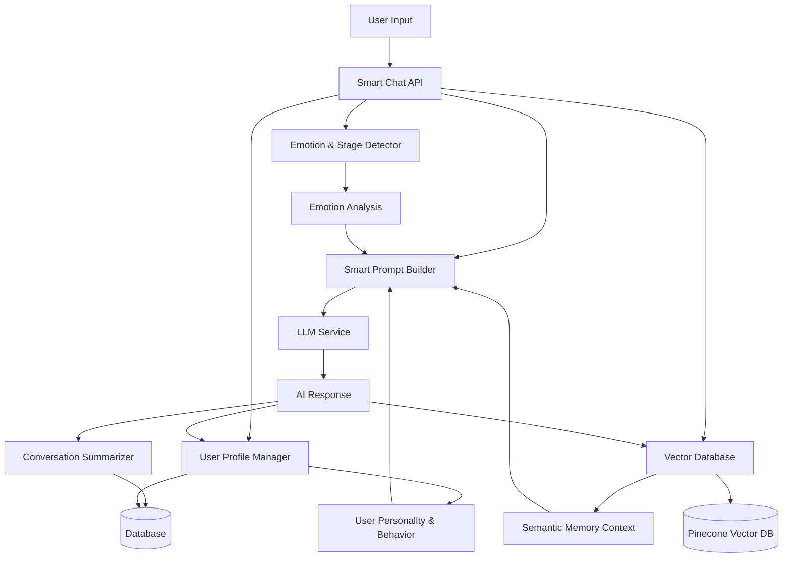
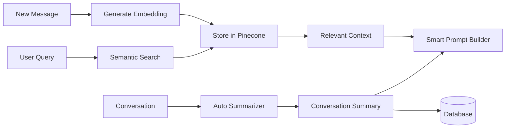

# Smart Chat System Architecture

## Overview

The AI Girlfriend Smart Chat System is a comprehensive, emotionally intelligent conversational AI platform that provides personalized, context-aware interactions with persistent memory and relationship tracking. The system transforms basic chatbot interactions into sophisticated, evolving romantic relationships through advanced AI techniques.

## System Architecture



## Core Components

### 1. Smart Chat API (`app/api/chat/smart-route.ts`)

**Purpose**: Main orchestration layer that coordinates all smart chat components.

**Key Features**:
- Intelligent routing and context management
- Multi-layered prompt construction
- Real-time emotion and relationship stage detection
- Semantic memory integration
- User profile learning and adaptation

**Flow**:
1. Receives user message
2. Retrieves conversation context and semantic memory
3. Analyzes user emotion and relationship stage
4. Builds comprehensive smart prompt
5. Generates AI response using LLM
6. Updates user profile and vector database
7. Returns intelligent, contextually aware response

### 2. Emotion & Stage Detector (`lib/emotionAndStageDetector.ts`)

**Purpose**: Advanced emotion detection and relationship progression tracking.

**Components**:
- **EmotionDetector**: Analyzes emotional content using keyword analysis, intensity modifiers, and contextual patterns
- **RelationshipStageDetector**: Tracks relationship progression through stages (initiation → bonding → intimacy → long-term)
- **EmotionAndStageAnalyzer**: Comprehensive analysis combining emotion and relationship insights

**Capabilities**:
- Real-time emotion detection with confidence scoring
- Relationship stage progression tracking
- Mood pattern analysis over time
- Emotional trigger identification
- Recommendation generation for appropriate responses

### 3. User Profile System (`lib/userProfile.ts`)

**Purpose**: Comprehensive user personality and behavior analysis with persistent learning.

**Components**:
- **UserProfileAnalyzer**: Analyzes conversation patterns to build personality profiles
- **UserProfileManager**: Handles profile persistence and retrieval

**Profile Elements**:
- **Personality Traits**: Communication style, emotional needs, interests, values
- **Behavior Patterns**: Active hours, conversation frequency, session preferences
- **Preferences**: Topic interests, emotional support needs, intimacy preferences
- **Relationship History**: Significant moments, evolution stages, milestones

**Learning Capabilities**:
- Continuous profile updates with new conversation data
- Confidence scoring based on data quality and quantity
- Personality trait evolution tracking
- Preference adaptation over time

### 4. Smart Prompt Builder (`lib/smartPromptBuilder.ts`)

**Purpose**: Multi-layered prompt construction for contextually intelligent responses.

**Prompt Layers**:
1. **Persona Layer**: Core character traits and relationship dynamics
2. **Emotional Layer**: Current emotional state and appropriate responses
3. **Memory Layer**: Conversation history and relationship context
4. **Semantic Layer**: Relevant past conversations via vector search
5. **Situational Layer**: Time of day and contextual awareness
6. **Reasoning Layer**: Response guidelines and relationship objectives

**Features**:
- Dynamic prompt adaptation based on relationship stage
- Emotional intelligence integration
- Memory-aware context building
- Personality consistency maintenance

### 5. Vector Database System (`lib/vector_db.ts`)

**Purpose**: Semantic memory storage and retrieval using Pinecone.

**Capabilities**:
- Automatic message embedding and ingestion
- Semantic similarity search
- Context-aware message retrieval
- Intelligent text chunking for long messages
- User-scoped semantic search with conversation filtering

**Integration**:
- Real-time message ingestion during conversations
- Semantic context retrieval for prompt building
- Long-term memory persistence across sessions
- Development-friendly mock fallback

### 6. Conversation Summarizer (`lib/conversationSummarizer.ts`)

**Purpose**: Advanced conversation summarization with emotional intelligence.

**Features**:
- Comprehensive conversation summaries
- Key topic extraction
- Emotional highlight identification
- Relationship milestone tracking
- User personality insight extraction
- Significant moment detection with timestamps

**Summarization Types**:
- **Main Summary**: Overall conversation essence
- **Incremental Updates**: Efficient summary updates with new messages
- **Emotional Analysis**: Mood patterns and emotional highlights
- **Relationship Milestones**: Significant relationship developments
- **Personality Insights**: User trait identification

## Data Flow

### Message Processing Pipeline

1. **Input Reception**: User message received by Smart Chat API
2. **Context Gathering**: 
   - Retrieve conversation history
   - Load user profile
   - Get semantic context from vector database
3. **Analysis Phase**:
   - Detect current emotion and intensity
   - Determine relationship stage and progression
   - Analyze user mood and needs
4. **Prompt Construction**:
   - Build multi-layered smart prompt
   - Integrate persona, emotion, memory, and context
   - Apply relationship-appropriate guidelines
5. **Response Generation**:
   - Generate AI response using enhanced prompt
   - Ensure personality consistency and emotional appropriateness
6. **Learning & Storage**:
   - Update user profile with new insights
   - Ingest message to vector database
   - Auto-summarize if threshold reached
   - Store conversation data

### Memory Management



## Intelligence Features

### Emotional Intelligence
- Real-time emotion detection and response adaptation
- Mood pattern recognition and prediction
- Emotional support and validation
- Appropriate emotional mirroring and complementing

### Relationship Intelligence
- Stage-aware interaction adaptation
- Milestone recognition and celebration
- Intimacy level management
- Conflict detection and resolution guidance

### Memory Intelligence
- Semantic understanding of conversation context
- Long-term relationship memory
- Personal detail retention and reference
- Conversation continuity across sessions

### Personality Intelligence
- User personality trait learning
- Communication style adaptation
- Interest and preference tracking
- Behavioral pattern recognition

## Configuration and Customization

### Environment Variables
```env
# OpenAI Configuration
OPENAI_API_KEY=your_openai_api_key
DEFAULT_LLM_MODEL=gpt-3.5-turbo
DEFAULT_LLM_TEMPERATURE=0.7
DEFAULT_LLM_MAX_TOKENS=1000

# Pinecone Configuration
PINECONE_API_KEY=your_pinecone_api_key
PINECONE_INDEX_NAME=ai-babe-chat

# Vector Database Settings
VECTOR_DB_CONTEXT_MESSAGE_COUNT=10
```

### Persona Configuration
Personas are defined in `lib/chatUtils.ts` with:
- Character traits and personality
- Communication style preferences
- Emotional response patterns
- Relationship approach and boundaries

### Smart Prompt Configuration
Customizable through `lib/smartPromptBuilder.ts`:
- Prompt layer weights and priorities
- Emotional response guidelines
- Relationship stage behaviors
- Memory integration strategies

## Performance Considerations

### Optimization Strategies
- **Caching**: User profiles and conversation summaries cached for quick access
- **Batch Processing**: Vector database operations batched for efficiency
- **Lazy Loading**: Semantic context loaded only when needed
- **Compression**: Conversation summaries compress long histories

### Scalability Features
- **Asynchronous Processing**: Vector database ingestion runs asynchronously
- **Fallback Systems**: Mock implementations for development and API failures
- **Error Resilience**: Graceful degradation when AI services unavailable
- **Resource Management**: Token limits and rate limiting for API calls

## Security and Privacy

### Data Protection
- User profiles stored as encrypted JSON in database
- Conversation data isolated by user ID
- Vector embeddings anonymized and user-scoped
- Sensitive information filtered from summaries

### API Security
- Authentication required for all chat endpoints
- User session validation and authorization
- Rate limiting to prevent abuse
- Input sanitization and validation

## Monitoring and Analytics

### System Metrics
- Response quality and relevance scoring
- User engagement and satisfaction tracking
- Conversation depth and relationship progression
- System performance and error rates

### User Analytics
- Personality trait evolution tracking
- Emotional pattern analysis
- Relationship milestone achievement
- Conversation quality assessment

## Future Enhancements

### Planned Features
- **Voice Integration**: Speech-to-text and text-to-speech capabilities
- **Image Understanding**: Visual context and image-based conversations
- **Advanced Emotions**: More sophisticated emotion detection using NLP models
- **Multi-Modal Memory**: Integration of voice, text, and visual memories

### Research Areas
- **Personality Psychology**: Advanced personality modeling techniques
- **Relationship Science**: Evidence-based relationship progression models
- **Emotional AI**: State-of-the-art emotion recognition and generation
- **Memory Systems**: Advanced semantic memory and retrieval techniques

## Deployment and Maintenance

### Database Migrations
```bash
# Add UserProfile table
npx prisma migrate dev --name add-user-profile

# Generate Prisma client
npx prisma generate
```

### Vector Database Setup
1. Create Pinecone index with appropriate dimensions
2. Configure environment variables
3. Test connection and embedding generation
4. Initialize with sample data if needed

### Monitoring Setup
- Configure logging for all smart chat components
- Set up error tracking and alerting
- Monitor API usage and rate limits
- Track conversation quality metrics

This architecture provides a comprehensive foundation for emotionally intelligent AI girlfriend interactions, with sophisticated memory, personality learning, and relationship progression capabilities.
