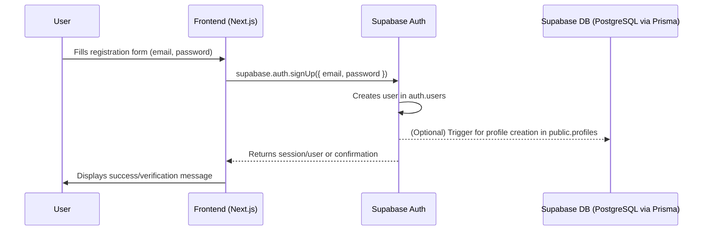
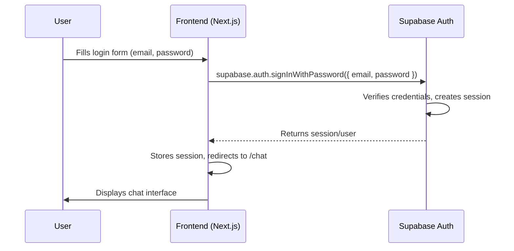
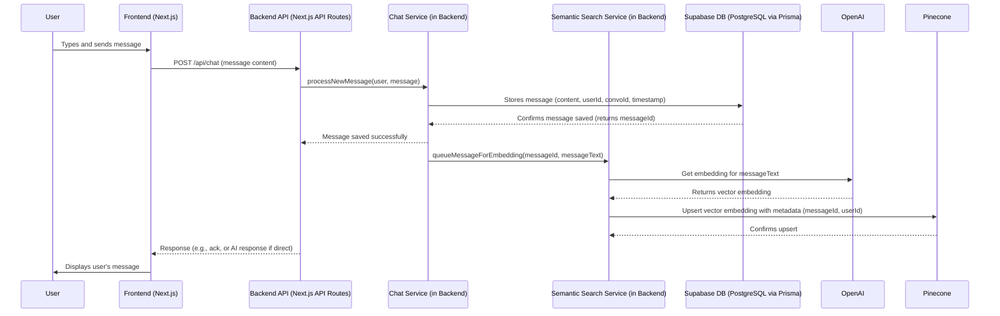
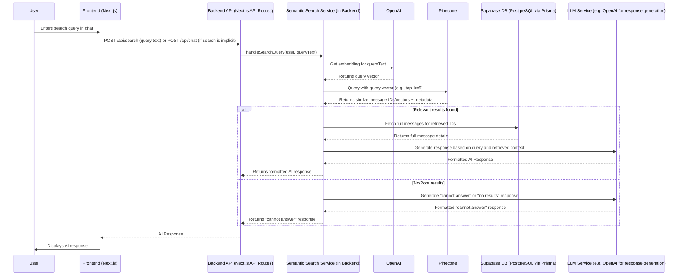

# System Architecture: Enhanced Chat Functionality with User Authentication and Semantic Search

## 1. Introduction

This document outlines the high-level system architecture for the "Enhanced Chat Functionality with User Authentication and Semantic Search" project. The system aims to provide users with a secure and intelligent chat experience, leveraging modern technologies for authentication, real-time communication, and advanced search capabilities.

The primary goals of this architecture are:
*   To support robust user authentication and management.
*   To enable real-time chat functionalities.
*   To integrate semantic search for enhanced information retrieval from chat history.
*   To ensure a scalable, secure, and maintainable system.

This architecture is designed to meet the requirements implicitly defined by the High-Level Acceptance Tests ([`docs/high_level_acceptance_tests_chat_auth_search.md`](docs/high_level_acceptance_tests_chat_auth_search.md)) and the Master Acceptance Test Plan ([`docs/master_acceptance_test_plan_chat_auth_search.md`](docs/master_acceptance_test_plan_chat_auth_search.md)).

## 2. Architectural Principles

*   **Modularity:** Components are designed to be loosely coupled and independently deployable/scalable where appropriate.
*   **Separation of Concerns:** Each service or component has a distinct responsibility.
*   **Scalability:** The architecture should be able to handle a growing number of users and data.
*   **Security:** Security is a primary concern, especially for user data and authentication.
*   **Maintainability:** The system should be easy to understand, modify, and extend.
*   **Leverage Managed Services:** Utilize managed services (Supabase, Pinecone, OpenAI) to reduce operational overhead and benefit from their specialized capabilities.

## 3. System Components

The system is composed of the following major components:

1.  **Frontend Application (Next.js/TypeScript)**
2.  **Backend API (Next.js API Routes)**
3.  **Authentication Service (Supabase Auth)**
4.  **Chat Service (Backend Logic)**
5.  **Semantic Search Service (Backend Logic with Pinecone & OpenAI)**
6.  **Databases:**
    *   **Primary Database (Supabase PostgreSQL)**
    *   **Vector Database (Pinecone)**

### 3.1. Frontend Application

*   **Technology:** Next.js, TypeScript, React
*   **Responsibilities:**
    *   User Interface (UI) for registration, login, chat, and other user interactions.
    *   Client-side state management.
    *   Rendering chat messages and search results.
    *   Interacting with the Backend API for data and operations.
    *   Handling user authentication state (e.g., storing tokens, redirecting based on auth status) using Supabase client libraries (e.g., `@supabase/ssr`).
*   **Key Interactions:**
    *   Communicates with Backend API routes for chat messages, search queries, and user profile management.
    *   Directly interacts with Supabase Auth for client-side authentication flows (sign-up, login, logout, session management).

### 3.2. Backend API (Next.js API Routes)

*   **Technology:** Next.js API Routes (Node.js environment)
*   **Responsibilities:**
    *   Provide HTTP endpoints for frontend interactions.
    *   Handle business logic for chat and semantic search.
    *   Orchestrate calls to external services (Supabase DB, Pinecone, OpenAI).
    *   Validate incoming requests and format responses.
    *   Secure API routes, ensuring only authenticated users can access protected resources (using Supabase session verification, potentially via middleware).
*   **Key API Endpoints (Conceptual):**
    *   `/api/auth/*`: (Handled by Supabase libraries or custom handlers interacting with Supabase Auth) - e.g., callback routes.
    *   `/api/chat`: For sending messages, retrieving conversation history.
    *   `/api/search`: For submitting semantic search queries.
    *   `/api/user/profile`: For managing user profile data.

### 3.3. Authentication Service (Supabase Auth)

*   **Technology:** Supabase Auth
*   **Responsibilities:**
    *   User registration (creating new user accounts).
    *   User login (verifying credentials).
    *   Session management (issuing and validating JWTs/session tokens).
    *   Password management (resets, updates - handled by Supabase).
    *   Third-party OAuth providers (if configured).
*   **Integration:**
    *   Frontend uses Supabase client libraries for auth UI flows.
    *   Backend API verifies user sessions/tokens using Supabase server-side libraries or middleware to protect routes.

### 3.4. Chat Service (Backend Logic)

*   **Location:** Implemented within Backend API routes.
*   **Responsibilities:**
    *   Receiving new messages from authenticated users.
    *   Storing messages in the Primary Database (Supabase PostgreSQL).
    *   Retrieving conversation history.
    *   Potentially broadcasting messages in real-time (if real-time features beyond simple request-response are implemented, e.g., using Supabase Realtime).
    *   Triggering the Semantic Search Service to embed and upsert new messages into Pinecone.
*   **Key Interactions:**
    *   Reads/writes chat messages to Supabase PostgreSQL.
    *   Invokes the Semantic Search Service for message processing.

### 3.5. Semantic Search Service (Backend Logic)

*   **Location:** Implemented within Backend API routes, potentially as dedicated modules (e.g., [`lib/vector_db.ts`](lib/vector_db.ts)).
*   **Responsibilities:**
    *   **Embedding:**
        *   Receiving text (new messages or search queries).
        *   Calling the OpenAI API to generate vector embeddings for the text.
    *   **Upserting:**
        *   Storing the generated vector embeddings (along with metadata like message ID, user ID) into the Pinecone vector database. This happens asynchronously after a new message is saved to Supabase.
    *   **Querying:**
        *   Receiving a search query embedding.
        *   Querying the Pinecone database to find semantically similar message vectors.
        *   Returning a list of relevant message IDs or metadata.
*   **Key Interactions:**
    *   Communicates with OpenAI API for generating embeddings.
    *   Communicates with Pinecone API for upserting and querying vectors.
    *   Receives data from the Chat Service (new messages) or API requests (search queries).

### 3.6. Databases

#### 3.6.1. Primary Database (Supabase PostgreSQL)

*   **Technology:** PostgreSQL (managed by Supabase)
*   **ORM:** Prisma (schema defined in [`prisma/schema.prisma`](prisma/schema.prisma))
*   **Responsibilities:**
    *   Storing user accounts and profiles (managed by Supabase Auth and custom profile tables).
    *   Storing chat conversation metadata.
    *   Storing individual chat messages (content, sender, timestamp, etc.).
    *   Storing any other structured application data.
*   **Data Integrity:** Enforced via Prisma schema and PostgreSQL constraints.
*   **Access:** Accessed by the Backend API (Chat Service, User Profile logic) via Prisma.

#### 3.6.2. Vector Database (Pinecone)

*   **Technology:** Pinecone
*   **Responsibilities:**
    *   Storing vector embeddings of chat messages.
    *   Enabling efficient similarity searches on these embeddings.
*   **Access:** Accessed by the Semantic Search Service (Backend Logic).
*   **Configuration:** Connection details and index name managed via environment variables (e.g., in [`.env.local`](.env.local)).

## 4. Technology Stack Summary

*   **Frontend:** Next.js, React, TypeScript
*   **Backend API:** Next.js API Routes (Node.js)
*   **Authentication:** Supabase Auth
*   **Primary Database:** Supabase (PostgreSQL) with Prisma ORM
*   **Vector Database:** Pinecone
*   **Embeddings Service:** OpenAI API
*   **Deployment (Assumed):** Vercel for Next.js application, Supabase Cloud, Pinecone Cloud, OpenAI Cloud.

## 5. Data Flow Diagrams

### 5.1. User Registration Flow

*Supports Acceptance Tests: 1.1, 1.5*

### 5.2. User Login Flow

*Supports Acceptance Tests: 1.2, 1.3*

### 5.3. Sending a Chat Message & Semantic Processing

*Supports Acceptance Tests: 3.1, 3.2*

### 5.4. Semantic Search Query Flow

*Supports Acceptance Tests: 3.1, 3.3*

## 6. Component Interactions & API Contracts (High-Level)

*   **Frontend <=> Backend API:**
    *   RESTful API calls over HTTPS.
    *   Frontend sends requests (e.g., new message, search query) and receives responses (e.g., chat history, search results, AI-generated text).
    *   Authentication handled via tokens (e.g., Supabase JWTs) passed in Authorization headers or cookies managed by `@supabase/ssr`.
*   **Backend API <=> Supabase (Auth & DB):**
    *   Supabase client libraries for authentication.
    *   Prisma client for database operations (CRUD on users, messages, conversations).
*   **Backend API (Semantic Search Service) <=> OpenAI:**
    *   HTTPS API calls to OpenAI's embedding endpoints.
    *   Request: Text to be embedded.
    *   Response: Vector embedding.
*   **Backend API (Semantic Search Service) <=> Pinecone:**
    *   HTTPS API calls using Pinecone SDK.
    *   Upsert: Vector embeddings and metadata.
    *   Query: Query vector, returns similar vectors/IDs.

## 7. Alignment with Acceptance Tests & AI Verifiable Tasks

This architecture directly supports the AI verifiable tasks outlined in the High-Level Acceptance Tests ([`docs/high_level_acceptance_tests_chat_auth_search.md`](docs/high_level_acceptance_tests_chat_auth_search.md)):

*   **User Authentication (Tests 1.1 - 1.5):**
    *   The **Frontend App** handles UI for registration/login.
    *   **Supabase Auth** provides the core authentication logic (user creation, credential verification, session management).
    *   **Supabase DB** stores user profiles.
    *   AI Verifiable Criteria: UI changes (redirection, messages), session cookies, and subsequent access to protected routes are supported by this component interaction.
*   **Authenticated Access to Chat (Tests 2.1 - 2.2):**
    *   **Backend API** (Next.js middleware or route handlers) verifies Supabase sessions before granting access to chat-related API endpoints.
    *   **Frontend App** manages routing based on authentication state.
    *   AI Verifiable Criteria: Redirection logic and UI element visibility based on auth status are handled by the frontend and backend auth checks.
*   **Core Chat & Semantic Search (Tests 3.1 - 3.3):**
    *   **Frontend App** sends messages and displays responses.
    *   **Chat Service** (in Backend API) persists messages to **Supabase DB**.
    *   **Semantic Search Service** (in Backend API) uses **OpenAI** for embeddings and **Pinecone** for vector storage/query.
    *   The flow ensures user messages are processed, relevant information is retrieved (or a "not found" message is generated), and a response is displayed.
    *   AI Verifiable Criteria: UI updates with sent/received messages, content relevance (checked by an external AI/NLP model or keyword matching for simpler cases), and timely responses are all supported. The architecture ensures the P1001 error is mitigated by proper Supabase client configuration and connection pooling (handled by Supabase).
*   **Error Handling (Tests 4.1 - 4.2):**
    *   **Backend API** routes include try-catch blocks and error handling logic to gracefully manage failures from external services (OpenAI, Pinecone, Supabase).
    *   Standardized error responses are sent to the **Frontend App**, which displays user-friendly messages.
    *   AI Verifiable Criteria: Display of user-friendly error messages and application stability are ensured by robust error handling in the backend and frontend. The architecture anticipates potential P1001 errors by relying on Supabase's managed connection pooling and Prisma's error handling.

## 8. Quality Attributes

### 8.1. Scalability

*   **Frontend/Backend API (Next.js on Vercel):** Vercel provides serverless functions for API routes and static hosting, which scale automatically with demand.
*   **Supabase:** As a managed service, Supabase handles database scaling. Connection pooling (via Supabase PgBouncer) is crucial and assumed to be correctly configured (`DATABASE_URL` with port `6543`).
*   **Pinecone:** Designed for large-scale vector search and scales independently.
*   **OpenAI:** A highly scalable API service.
*   **Considerations:** Asynchronous processing for embedding and upserting messages to Pinecone (e.g., using a message queue or background jobs if load increases significantly) can improve responsiveness of the chat API.

### 8.2. Security

*   **Authentication:** Supabase Auth provides robust authentication (JWTs, secure password handling, RLS for database access).
*   **API Security:** Backend API routes must be protected, ensuring only authenticated users can access sensitive data/operations. Input validation is critical to prevent injection attacks.
*   **Data Security:**
    *   Supabase: RLS to ensure users can only access their own data. SSL for connections.
    *   Pinecone/OpenAI: API keys managed securely (environment variables). Data in transit encrypted via HTTPS.
*   **Frontend Security:** Standard web security practices (XSS prevention, CSRF protection if applicable for form submissions not handled by Next.js API routes directly).

### 8.3. Performance

*   **Database Queries:** Efficient Prisma queries and proper indexing in Supabase PostgreSQL are important.
*   **Vector Search:** Pinecone is optimized for fast vector similarity search.
*   **Embedding Generation:** OpenAI embedding model performance is generally good, but latency should be monitored. Consider caching embeddings if applicable.
*   **API Response Times:** Backend API should be optimized for quick responses. Asynchronous operations for non-critical path tasks (like background embedding) are key.
*   **Frontend Rendering:** Next.js provides server-side rendering (SSR) and static site generation (SSG) capabilities that can improve perceived performance. Client-side rendering of chat should be optimized.

### 8.4. Maintainability

*   **Modularity:** Separation of concerns into Frontend, Backend API, and distinct services (Auth, Chat, Semantic Search) improves maintainability.
*   **Technology Choices:** Using popular and well-documented technologies (Next.js, TypeScript, Supabase, Prisma, Pinecone, OpenAI) makes it easier to find developers and resources.
*   **Code Quality:** Consistent coding standards, clear documentation (including this architecture doc), and comprehensive testing are crucial.
*   **Prisma:** Simplifies database interactions and schema management.

## 9. Foundational Step & Scaffolding Needs

This architecture serves as a foundational step for the 'Implement Enhanced Chat Functionality with User Authentication and Semantic Search' project. Key scaffolding needs include:

*   **Next.js Project Setup:** Basic Next.js application structure with TypeScript.
*   **Supabase Integration:**
    *   Setting up Supabase project and configuring environment variables.
    *   Initializing Supabase client (both client-side and server-side, e.g., using `@supabase/ssr`).
    *   Defining Prisma schema ([`prisma/schema.prisma`](prisma/schema.prisma)) for user profiles, conversations, and messages. Running `prisma generate` and `prisma db push` (or migrations).
*   **Authentication UI:** Scaffolding for registration, login, and logout pages/components.
*   **Chat Interface UI:** Basic UI components for message input, message display, and conversation list.
*   **API Route Structure:** Creating placeholder API routes for chat, search, and user profile.
*   **Pinecone & OpenAI SDK Integration:**
    *   Installing necessary SDKs (`@pinecone-database/pinecone`, `openai`).
    *   Setting up client initialization logic (e.g., in `lib/vector_db.ts`, `lib/llm_service.ts`).
    *   Configuring environment variables for API keys and Pinecone index details.
*   **Middleware for Auth:** Implementing Next.js middleware to protect authenticated routes using Supabase session verification.
*   **Basic Error Handling Framework:** Setting up a consistent way to handle and display errors.

This foundational scaffolding will enable iterative development of the features outlined in the (absent) Master Project Plan and verified by the Acceptance Tests.

## 10. Future Considerations

*   **Real-time Chat:** For a more dynamic chat experience, integrate Supabase Realtime for broadcasting messages.
*   **Advanced User Profile Management:** Expand user profile features.
*   **Conversation Management:** Features like deleting conversations, renaming, etc.
*   **Scalable Asynchronous Processing:** Implement a robust message queue (e.g., RabbitMQ, Kafka, or a cloud-native solution like AWS SQS/Google PubSub if moving beyond Vercel's capabilities for background tasks) for embedding and other background tasks if the load increases significantly. Vercel Cron Jobs could be an initial simpler step for periodic tasks.
*   **Monitoring and Logging:** Integrate comprehensive logging and monitoring solutions.