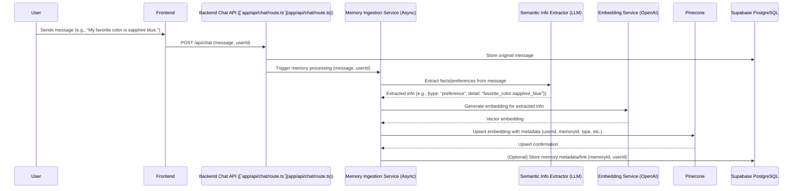
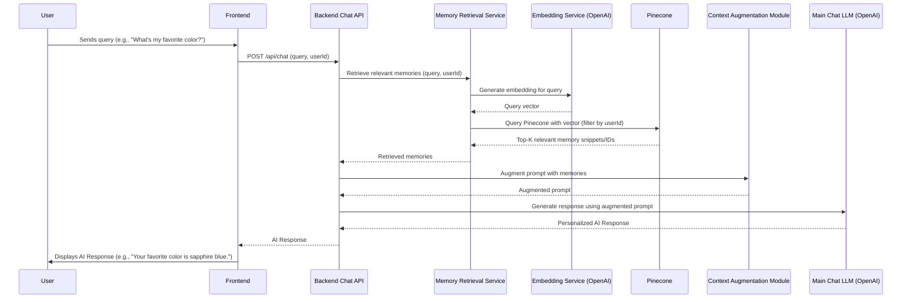

# High-Level Architecture: Advanced Chat with Semantic Memory

## 1. Introduction

This document outlines the high-level architecture for the "Advanced Chat with Semantic Memory" feature. The purpose of this feature is to enable the AI to remember key facts, user preferences, and past interaction details across multiple sessions, leading to more personalized, contextually aware, and adaptive conversations.

This architecture is designed to support the AI-verifiable tasks and overall goals defined in:
*   High-Level Acceptance Tests (HLTs): [`docs/technical/advanced_chat_semantic_memory_acceptance_tests.md`](docs/technical/advanced_chat_semantic_memory_acceptance_tests.md)
*   Master Project Plan (Semantic Memory Feature Section - synthesized from Pheromone signal `c7a3f5b0-1d9e-4c8a-9f2b-8e1d0a7c4b6f`):
    *   Phase 4: Design and Setup Semantic Memory Infrastructure
    *   Phase 5: Implement Semantic Memory Capture and Embedding
    *   Phase 6: Implement Semantic Memory Retrieval and Application
    *   Phase 7: Testing, Refinement, and Security for Semantic Memory

It integrates with the existing system described in [`docs/system_architecture_chat_auth_search.md`](docs/system_architecture_chat_auth_search.md).

## 2. Architectural Goals

*   **Accuracy & Relevance:** Ensure recalled memories are accurate and contextually relevant to the ongoing conversation.
*   **Personalization:** Enable the AI to tailor responses based on recalled user-specific information.
*   **Scalability:** The memory system should scale to accommodate a growing number of users and memories.
*   **Performance:** Memory retrieval and application should not introduce significant latency to chat responses.
*   **Maintainability:** Components should be modular and well-defined for ease of understanding and future enhancements.
*   **Security & Privacy:** User memories must be stored securely, be user-specific, and handle PII appropriately. Provide mechanisms for users to manage or clear their memories (as per HLT-SM-005).
*   **Integration:** Seamlessly integrate with the existing chat, authentication, and database systems.

## 3. Key Components

The Semantic Memory feature will introduce the following key components:

1.  **Semantic Information Extractor:**
    *   **Responsibility:** Identifies and extracts salient facts, preferences, and key entities from user messages or conversation turns. This component will likely leverage an LLM (e.g., OpenAI GPT model).
    *   **Input:** User message text, conversation context.
    *   **Output:** Structured or semi-structured representation of potential memories (e.g., {type: "preference", detail: "formal_tone"}, {type: "fact", entity: "Project Alpha", attribute: "deadline", value: "2025-12-31"}).

2.  **Memory Embedding Service:**
    *   **Responsibility:** Converts extracted semantic information into vector embeddings suitable for similarity search.
    *   **Technology:** OpenAI Embedding API (e.g., `text-embedding-ada-002` or a newer model).
    *   **Input:** Extracted semantic information (textual representation).
    *   **Output:** Vector embedding.

3.  **Semantic Memory Storage (Vector Database):**
    *   **Responsibility:** Stores vector embeddings of semantic information along with associated metadata.
    *   **Technology:** Pinecone (as per existing system architecture).
    *   **Metadata:** `userId`, `memoryId` (unique ID for the memory chunk), `timestamp`, `sourceMessageId`, `memoryType` (fact, preference), `entity`, `attribute`, `originalTextSnippet`.

4.  **Memory Ingestion Service:**
    *   **Responsibility:** Orchestrates the process of extracting, embedding, and storing new memories. This service will likely be an asynchronous background process triggered after a message is processed by the core chat service.
    *   **Input:** New user message, `userId`, `conversationId`.
    *   **Output:** Confirmation of memory ingestion into Pinecone and potentially metadata storage in Supabase PostgreSQL.

5.  **Memory Retrieval Service:**
    *   **Responsibility:** Retrieves relevant memories from Semantic Memory Storage based on the current conversation context or explicit user queries about past information.
    *   **Input:** Current user query/message, `userId`, conversation context.
    *   **Process:**
        1.  Generate an embedding for the input query/context.
        2.  Query Pinecone for top-K similar memory vectors for the specific `userId`.
        3.  Filter/rank retrieved memories based on relevance, recency, and type.
    *   **Output:** A set of relevant memories (text snippets, structured data).

6.  **Contextual Augmentation & Response Generation Module:**
    *   **Responsibility:** Integrates retrieved memories into the prompt for the main chat LLM to generate a contextually aware and personalized response. Manages potential conflicts or updates in memory (e.g., recency bias as per HLT-SM-008).
    *   **Input:** Original user query, retrieved memories, conversation history.
    *   **Output:** Augmented prompt for the chat LLM, or directly influences response generation.

7.  **Memory Management API/Service:**
    *   **Responsibility:** Provides endpoints or functions for managing memories, such as updating, correcting (HLT-SM-007), or clearing memories for a user (HLT-SM-005).
    *   **Input:** User request (e.g., clear memory, update preference).
    *   **Output:** Confirmation of action.

## 4. Data Flows

### 4.1. Memory Ingestion Flow



### 4.2. Memory Retrieval & Application Flow



### 4.3. Memory Update/Correction Flow (HLT-SM-007)

1.  **User Statement:** User makes a corrective statement (e.g., "Correction: My upcoming trip is actually to Rome, not Paris.").
2.  **Ingestion:** The Memory Ingestion Service processes this new statement.
3.  **Conflict Detection/Resolution (within Memory Ingestion or Retrieval):**
    *   The Semantic Information Extractor should identify this as an update to a previous fact.
    *   The system may mark the old memory ("trip to Paris") as outdated or assign a lower relevance score.
    *   The new memory ("trip to Rome") is ingested with a newer timestamp.
4.  **Retrieval:** The Memory Retrieval Service, when queried about the trip, should prioritize the "Rome" memory due to recency or explicit update markers.

### 4.4. Memory Clearing Flow (HLT-SM-005)

1.  **User Request:** User initiates a memory clear action via a UI element or command.
2.  **API Call:** Frontend calls a dedicated API endpoint (e.g., `/api/user/memory/clear`).
3.  **Memory Management Service:**
    *   Authenticates the user.
    *   Deletes all vector embeddings associated with the `userId` from Pinecone.
    *   Deletes or flags associated metadata in Supabase PostgreSQL.
4.  **Confirmation:** Service returns success to the frontend. Subsequent queries should not recall cleared information.

## 5. Technology Choices

*   **5.1. Vector Database:** **Pinecone**
    *   **Justification:** Already integrated into the existing system ([`docs/system_architecture_chat_auth_search.md`](docs/system_architecture_chat_auth_search.md)). Proven scalability, performance for high-speed similarity search, and managed service benefits.
*   **5.2. Embedding Model:** **OpenAI `text-embedding-ada-002`** (or a newer, compatible model)
    *   **Justification:** Already integrated for semantic search. Provides good quality embeddings at a reasonable cost. Compatibility with OpenAI LLMs for information extraction and response generation.
*   **5.3. Semantic Information Extractor & Contextual Augmentation:** **OpenAI GPT models** (e.g., GPT-3.5-turbo, GPT-4)
    *   **Justification:** Strong natural language understanding capabilities required to accurately identify facts, preferences, and nuances from user text. Can also handle the contextual augmentation and conflict resolution logic.
*   **5.4. Primary Data & Metadata Storage:** **Supabase PostgreSQL** with **Prisma ORM**
    *   **Justification:** Existing primary database. Suitable for storing structured metadata related to semantic memories (e.g., `memoryId`, `userId`, `timestamp`, `memoryType`, links to original messages) and for managing user-specific memory configurations. Prisma simplifies database interactions.
*   **5.5. Asynchronous Processing:** (Consideration for Memory Ingestion)
    *   **Technology:** Vercel Serverless Functions (for initial implementation), potentially moving to a dedicated queue like BullMQ or a cloud-native queue (AWS SQS, Google Pub/Sub) if load increases.
    *   **Justification:** Decouples memory ingestion from the main chat response flow, ensuring chat responsiveness.

## 6. Integration with Existing System

*   **6.1. Chat Service ([`app/api/chat/route.ts`](app/api/chat/route.ts)):**
    *   **Ingestion Hook:** After a message is successfully saved to Supabase, the Chat API will (asynchronously) trigger the Memory Ingestion Service with the new message content, `userId`, and `conversationId`.
    *   **Retrieval Hook:** Before calling the main Chat LLM, the Chat API will invoke the Memory Retrieval Service to fetch relevant memories. These memories will be used to augment the prompt sent to the Chat LLM.
*   **6.2. User Authentication (Supabase Auth):**
    *   All memory operations (ingestion, retrieval, management) MUST be scoped to the authenticated `userId`. Pinecone queries will filter by `userId` metadata. Supabase RLS will protect memory metadata.
*   **6.3. Primary Database (Supabase PostgreSQL & Prisma):**
    *   A new Prisma model, `SemanticMemoryMetadata`, might be introduced:
        ```prisma
        model SemanticMemoryMetadata {
          id        String   @id @default(cuid())
          userId    String   // Foreign key to User.id
          user      User     @relation(fields: [userId], references: [id])
          pineconeVectorId String @unique // ID of the vector in Pinecone
          memoryType String   // e.g., "fact", "preference", "correction"
          contentSnippet String // A brief snippet of the original text
          extractedData Json?  // Structured representation of the memory
          sourceMessageId String? // Link to the original Message.id if applicable
          message   Message? @relation(fields: [sourceMessageId], references: [id])
          createdAt DateTime @default(now())
          updatedAt DateTime @updatedAt
          isActive  Boolean  @default(true) // For soft deletes or deactivation
        }
        ```
    *   This table will link Supabase user/message records to vectors in Pinecone.
*   **6.4. API Design:**
    *   Modify `/api/chat`: No new public-facing endpoints needed for basic ingestion/retrieval if integrated into the existing chat flow.
    *   New Endpoints (Memory Management):
        *   `POST /api/user/memory/update` (for explicit preference updates by user)
        *   `POST /api/user/memory/clear` (for HLT-SM-005)

## 7. Alignment with High-Level Acceptance Tests (HLTs)

*   **HLT-SM-001 (Factual Recall - Specific Detail):** Supported by Memory Ingestion (extracting "Project Alpha deadline"), Embedding, Pinecone storage, and Memory Retrieval (querying for "Project Alpha deadline" context) feeding into Chat LLM.
*   **HLT-SM-002 (Preference Recall & Application - Tone):** Semantic Info Extractor identifies "formal tone" preference. Memory Ingestion stores it. Memory Retrieval fetches it. Context Augmentation instructs Chat LLM to use a formal tone.
*   **HLT-SM-003 (Factual Recall - Multiple Distinct Facts):** Memory Ingestion processes both facts ("sapphire blue", "Sparky"). Retrieval service fetches both when prompted about "preferences and pets".
*   **HLT-SM-004 (Preference Recall & Application - Content Filtering):** "Avoid celebrity gossip" preference stored. When a related query comes, retrieval service fetches this preference. Context Augmentation module instructs Chat LLM to avoid/redirect.
*   **HLT-SM-005 (No Recall When Memory Cleared):** Memory Management API handles clearing Pinecone vectors and Supabase metadata for the user. Subsequent retrieval attempts find no relevant memories.
*   **HLT-SM-006 (Contextual Adaptation - Information Depth):** "Detailed technical answers" preference stored. Retrieval and Context Augmentation ensure Chat LLM provides in-depth explanations.
*   **HLT-SM-007 (Factual Recall - Correction/Update):** Memory Ingestion Service, with help from Semantic Info Extractor, identifies corrections. It can mark old memories as outdated (e.g., in `SemanticMemoryMetadata.isActive = false` or by overwriting based on `sourceMessageId` and `entity` if a unique key can be formed) and ingests the new fact. Retrieval prioritizes active/latest memories.
*   **HLT-SM-008 (Preference Recall - Conflicting Preferences/Recency):** Timestamps on memories (both in Pinecone metadata and `SemanticMemoryMetadata`) allow the Retrieval Service or Context Augmentation module to prioritize the most recent preference.

## 8. Alignment with Master Project Plan (Semantic Memory Feature)

This architecture directly supports the AI-verifiable tasks outlined in the (synthesized from pheromone signal `c7a3f5b0-1d9e-4c8a-9f2b-8e1d0a7c4b6f`) Master Project Plan for this feature:

*   **Phase 4: Design and Setup Semantic Memory Infrastructure**
    *   **AI Verifiable Outcome:** This architecture document itself. Pinecone index configured. New `SemanticMemoryMetadata` table created in Supabase via Prisma migration. Environment variables for new services/configurations are set up.
    *   **Supported by:** Sections 3, 5, 6.3 of this document.
*   **Phase 5: Implement Semantic Memory Capture and Embedding**
    *   **AI Verifiable Outcome:** User messages containing identifiable facts/preferences are processed by the Semantic Information Extractor, embedded by the Embedding Service, and successfully upserted into Pinecone with correct `userId` and metadata. Corresponding `SemanticMemoryMetadata` records are created.
    *   **Supported by:** Components: Semantic Information Extractor, Memory Embedding Service, Memory Ingestion Service, Semantic Memory Storage. Data Flow: 4.1.
*   **Phase 6: Implement Semantic Memory Retrieval and Application**
    *   **AI Verifiable Outcome:** When a user query has relevant context in stored semantic memories, the Memory Retrieval Service successfully fetches these memories, and the Context Augmentation module uses them to influence the Chat LLM's response, leading to personalized/contextual answers as per HLTs.
    *   **Supported by:** Components: Memory Retrieval Service, Context Augmentation Module. Data Flow: 4.2.
*   **Phase 7: Testing, Refinement, and Security for Semantic Memory**
    *   **AI Verifiable Outcome:** All HLTs (HLT-SM-001 to HLT-SM-008) pass. Security measures for memory data are implemented and verified. Performance meets acceptable thresholds. Memory update/clearing functions correctly.
    *   **Supported by:** Overall architecture, specific components like Memory Management API, and security considerations outlined in Section 9.

## 9. Scalability, Performance, and Security Considerations

*   **Scalability:**
    *   Pinecone and OpenAI are managed services designed for scale.
    *   Supabase PostgreSQL can be scaled. Connection pooling is essential.
    *   Asynchronous Memory Ingestion Service is crucial to prevent blocking chat API responses.
    *   The number of vectors per user needs monitoring; strategies for summarizing or archiving older/less relevant memories might be needed long-term.
*   **Performance:**
    *   Embedding generation and LLM-based extraction can add latency. Asynchronous processing for ingestion is key.
    *   Pinecone query speed is generally fast. Metadata filtering (by `userId`) is efficient.
    *   The complexity of the Context Augmentation logic can impact overall response time.
*   **Security & Privacy:**
    *   **Data Segregation:** All memories MUST be strictly segregated by `userId` in Pinecone (via metadata filtering) and Supabase (RLS).
    *   **PII Handling:** The Semantic Information Extractor should be designed to minimize storage of raw PII if possible, or flag memories containing PII. Consider if sensitive memories need shorter TTLs or explicit user consent.
    *   **Access Control:** API endpoints for memory management must be robustly authenticated and authorized.
    *   **Transparency & Control:** Users should be informed about memory collection and ideally have controls to view/delete their semantic memories (supports HLT-SM-005).
    *   **Data at Rest/Transit:** Standard encryption provided by Supabase, Pinecone, and OpenAI.

## 10. Future Considerations

*   **Advanced Memory Consolidation:** Implement mechanisms to summarize or consolidate related memories over time to improve relevance and reduce noise.
*   **Explicit User Memory Management Interface:** A UI for users to view, edit, or delete specific memories.
*   **Diverse Memory Types:** Expand beyond simple facts/preferences to include episodic memory (sequences of events) or emotional context.
*   **Proactive Memory Injection:** Allow the AI to proactively offer relevant information based on recalled memories, not just in response to direct queries.
*   **Configurable Memory Scope:** Allow users to define the scope or "freshness" of memories the AI should consider.