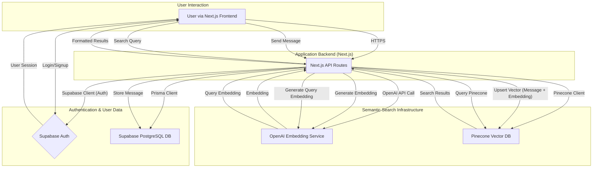

# Integrated Model & Architecture Considerations - Part 1

This document will synthesize findings into a cohesive model for the "Enhanced Chat Functionality" project, outlining architectural considerations based on the research.

## Initial Model Sketch (High-Level):

## Key Architectural Considerations (Initial):

1.  **Authentication Flow (Supabase):**
    *   Client-side (Next.js frontend) initiates auth requests (login, signup) to Supabase.
    *   Supabase Auth handles credential verification and JWT issuance.
    *   Next.js API routes will be protected, verifying JWTs (likely using Supabase helper libraries or custom middleware).
    *   Session management needs to be robust, handling token refresh and secure storage (e.g., secure HTTPOnly cookies).

2.  **Database Interaction (Prisma & Supabase):**
    *   Next.js API routes will use Prisma Client to interact with the Supabase PostgreSQL database for CRUD operations on users, conversations, messages, etc.
    *   **Critical:** Resolve P1001 error by ensuring correct `DATABASE_URL` (pointing to Supabase pooler on port `6543` with `sslmode=require`) and proper environment variable handling in Next.js (especially for Vercel deployment).
    *   Migrations managed by `prisma migrate`.

3.  **Semantic Search Flow (Pinecone & OpenAI):**
    *   **Ingestion:**
        *   After a message is saved to Supabase DB (via Next.js API route), trigger an asynchronous process (e.g., Supabase Edge Function, or a separate Next.js API route called internally).
        *   This process fetches the message content, generates an embedding using OpenAI API, and upserts the message ID, embedding, and relevant metadata (user ID, conversation ID, timestamp, original text) to Pinecone.
    *   **Querying:**
        *   User initiates a search from the Next.js frontend.
        *   A Next.js API route receives the search query.
        *   The API route generates an embedding for the search query using OpenAI.
        *   The API route queries Pinecone using this embedding, potentially filtering by `userId` or `conversationId`.
        *   Pinecone returns a list of similar message IDs and scores.
        *   The API route can then fetch the full message content from Supabase DB using these IDs to display to the user.

4.  **Configuration & Security:**
    *   All API keys (Supabase, Pinecone, OpenAI) and the `DATABASE_URL` must be stored securely as environment variables.
    *   For Next.js on Vercel, these will be configured in the Vercel project settings.
    *   Care must be taken to not expose backend-only keys to the client-side bundle.

5.  **Data Consistency:**
    *   Consider strategies for keeping Pinecone index synchronized with the Supabase DB (e.g., handling message edits/deletions). This might involve more complex event-driven updates or periodic reconciliation if strict consistency is required.

*(This model will be refined and expanded as more detailed research is conducted.)*